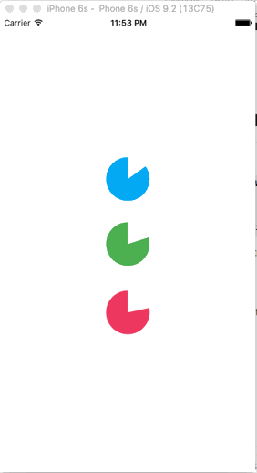

# SACircularCountdown  
UIView subclass used to indicate operation progress via a circular wedge style indicator.

## Demo

## Description
Draws a wedge that indicates countdown interval of time. Drawing is performed using a `UIBezierPath`.

### Features
- `@IBDesignable` properties for Interface Builder
- Ability to set a custom interval, circle radius
- Uses `CADisplayLink` for display-synchronized smoothness

## Installation
The easiest way to install and use is simply to include **SACircularCountdown.swift** into your project's "Compile Sources" build phase.

The project is set up as a shared framework (SACircularCountdown) to enable [Carthage](https://github.com/Carthage/Carthage) support if you don't care about taking on that complexity.

Alternatively, this can easily be added as a git submodule into your project.

## How To Use
* Implement an instance of `SACircularCountdown` (a subclass of `UIView`) in code or via Interface Builder
	* if IB, set the custom class to `SACircularCountdown` & if using the framework, make sure the framework is listed in your build phases

### Properties
Adjust these properties to customize the behavior of the countdown wedge.

* `circleColor`: What color to fill the progress circle.
* `circleRadius`: Size of the circle's radius `r`. Frame size will be the diameter `d` where `d = 2r`.
* `strokeColor`: Optional stroke color for the progress circle.
* `strokeWidth`: The width of the stroke around the wedge. Defaults to `0.0` (no stroke).
* `angle`: The angle in degrees to set the indicator's progress at. Defaults to `0.0`.
* `interval`: Length of cycle represented by this indicator. Defaults to `30.0` seconds.
* `baseDate`: Base date to calculate timer's interval. Defaults to `Date()`.

# License
The MIT License (MIT)

Copyright (c) 2015 Stefan Arambasich

Permission is hereby granted, free of charge, to any person obtaining a copy
of this software and associated documentation files (the "Software"), to deal
in the Software without restriction, including without limitation the rights
to use, copy, modify, merge, publish, distribute, sublicense, and/or sell
copies of the Software, and to permit persons to whom the Software is
furnished to do so, subject to the following conditions:

The above copyright notice and this permission notice shall be included in
all copies or substantial portions of the Software.

THE SOFTWARE IS PROVIDED "AS IS", WITHOUT WARRANTY OF ANY KIND, EXPRESS OR
IMPLIED, INCLUDING BUT NOT LIMITED TO THE WARRANTIES OF MERCHANTABILITY,
FITNESS FOR A PARTICULAR PURPOSE AND NONINFRINGEMENT. IN NO EVENT SHALL THE
AUTHORS OR COPYRIGHT HOLDERS BE LIABLE FOR ANY CLAIM, DAMAGES OR OTHER
LIABILITY, WHETHER IN AN ACTION OF CONTRACT, TORT OR OTHERWISE, ARISING FROM,
OUT OF OR IN CONNECTION WITH THE SOFTWARE OR THE USE OR OTHER DEALINGS IN
THE SOFTWARE.
